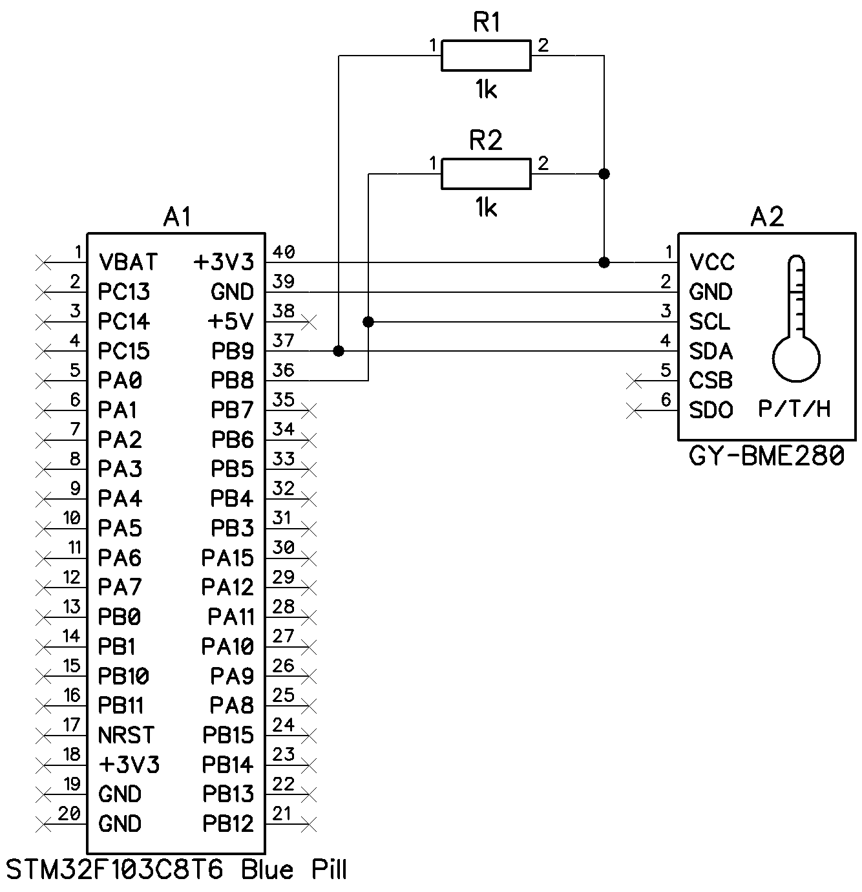

## BMEReader

### Description

This software is a firmware for the *STM32F411CEU6* MCU that turns it into an interface adapter for *BME280* sensor
devices. When connected to the USB host device, the MCU with the firmware uploaded in is detected as a virtual serial
port device. This enables a simple command-response communication protocol to control and read data from a *BME280*
sensor.

The project is partially generated using the *STM32CubeMx* software and uses the *STM32Cube* and *CMSIS* libraries.

### Requirements

The firmware targets the *STMicroelectronics STM32F411CEU6* MCU and relies on the *GNU ARM Embedded* open-source
toolchain which is required for building as well as the *CMake* software. It is recommended using the latest
*JetBrains CLion* IDE for building as the project was originally created using this environment and leverages its
workflow.

To eliminate the need in additional hardware development (power conversion circuits, external connectors, etc.) a
prototyping board with this MCU should be used. The most cost-efficient solution is usage of a *STM32F411CEU6 Black
Pill* board that has all the necessary hardware.

There are two main ways to upload the firmware to the *STM32F411CEU6* MCU:

* Using the *ST-LINK* hardware programmer (must be connected to the *JTAG/SWD* interface header of the board),
* Using the MCU's built-in USB bootloader (the MCU must be rebooted in the bootloader mode).

In both cases, the latest *STM32CubeProgrammer* software can be used to initiate firmware uploading. Also, when using
the *ST-LINK* programmer, the *OpenOCD* software is able to upload the firmware, and it can be performed directly from
the *CLion* IDE.

For the virtual serial port connection to function on the controlling system, the *STM32 Virtual COM Port* driver should
be installed. On some systems, like PCs running the latest *Windows 10*, it is not required as the driver is already
installed.

### Connection

To connect a BME280 sensor to the MCU board refer the provided schematic below (assuming the *Black Pill* MCU and
*GY-BME280* sensor boards are used):



In any case, these connections must be established between the MCU and the *BME280* device:

```
BME280          - MCU
---------------------
VDD/VDDIO (VCC) - VDD (+3V3)
GND             - GND
SCL             - PB8, also tie to VDD through a 1 kOhm resistor
SDA             - PB9, also tie to VDD through a 1 kOhm resistor
CSB             - VDD (+3V3), tie directly!
SDO             - GND
```

The MCU board must also be connected to the controlling device via USB.

### Communication

The *BMEReader* firmware provides a simple command-response protocol for communication with a connected *BME280*
device that is based on the virtual serial port connection handled over the USB interface. Any software capable of
working with serial ports can be used to establish such a communication. Since this is a virtual serial port, no
specific settings such as a bitrate are required.

Commands are case-insensitive. If a command accepts parameters, they must be put after a command delimiting with a space
symbol. Any command message must be terminated with a *LF* symbol (ASCII code *10* or a new line `'\n'` character in *C*
language) that indicates its end.

Any response begins of a status word: `OK` (command succeeded) or `ERROR` (command failed), and is followed with an
optional command result message. On command failure an error description is provided. Any message parts are delimited
from each other with semicolon and space symbols. Finally, response messages are also terminated with a *LF* symbol.

### Supported commands

*(LF termination symbols are omitted)*

* `Id` - returns an identification string of the *BMEReader* device. On success writes a firmware name, a firmware
  version, and a hex-encoded serial number of the MCU, e.g. `OK; BMEReader; Version: 1.0; SN: 0123456789ABCDEF01234567`.

* `Measure` - reads climatic data from the connected *BME280* device and formats them into readable values. Accepts one
  of mandatory parameters (added to the command after a space symbol):
    * `P` - gets the pressure value only,
    * `T` - gets the temperature value only,
    * `H` - gets the humidity value only,
    * `All` - gets all the values (pressure, temperature, and humidity).

  Pressure is expressed in millimeters of mercury (*mmHg*), temperature is expressed in degrees Celsius (*degC*), and
  humidity is expressed in percent (*%*). On success contains measured floating-point number and unit indicating a value
  for the specified magnitude (e.g. `OK; 25.123 degC` as a response for the `Measure T` command message). When all
  values are returned, they are written as a sequence prepended with a corresponding magnitude symbol (e.g.
  `OK; P = 750.123; T = 25.123 degC; H = 50.123 %` as a response for the `Measure All` command message).

* `Reset` - performs a software reset (reboot) of the MCU. Accepts one of two mandatory parameters (added to the command
  after a space symbol) representing the target mode to reboot into:
    * `Normal` - reboots the device into the normal mode (USB is configured as a virtual serial port),
    * `Bootloader` - reboots the device into the bootloader mode (USB is configured in DFU mode to update the firmware).

  On success returns the confirmation message, and in about 100 milliseconds the serial connection will be lost. After
  the device reboots (not longer than 1 second), it will be ready for communication in the selected mode.

### License

This software is created using the source code licensed under a number of licenses. See the
[License.md](License.md) file for more information.

### Links

* **[BMEReader Git repository page](https://github.com/Egiraht/BMEReader)**
* **[STMicroelectronics site](https://www.st.com/)**
* **[STM32F411CE MCU series page](https://www.st.com/en/microcontrollers-microprocessors/stm32f411ce.html)**
* **[STM32CubeMx software page](https://www.st.com/en/development-tools/stm32cubemx.html)**
* **[STM32CubeProgrammer software page](https://www.st.com/en/development-tools/stm32cubeprog.html)**
* **[STM32 Virtual COM Port driver page](https://www.st.com/en/development-tools/stsw-stm32102.html)**
* **[GNU ARM Embedded toolchain page](https://developer.arm.com/tools-and-software/open-source-software/developer-tools/gnu-toolchain/gnu-rm)**
* **[CMake project site](https://cmake.org/)**
* **[OpenOCD project site](http://openocd.org/)**
